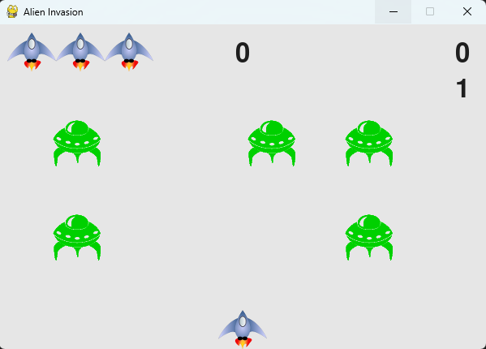

# 👾 Alien Invasion - A Python Game

## 🎮 Introduction  
*Alien Invasion* is a classic arcade-style shooting game built using **Python** and **Pygame**. The player controls a spaceship and must shoot down waves of aliens before they reach the bottom of the screen. As the game progresses, the difficulty increases, making it more challenging and fun!

This project is based on the **"Alien Invasion"** game from the book *Python Crash Course* by **Eric Matthes**. All credit for the original game concept and implementation goes to the author. This version may include modifications and improvements for learning and customization.

---

## 🎯 How to Play

- 🕹 **Move the spaceship**: Use the **left (←) and right (→) arrow keys** to move.  
- 🔫 **Shoot bullets**: Press the **spacebar** to fire at the aliens.  
- 👾 **Destroy all aliens**: Clear the screen before they reach the bottom.  
- ⚠ **Avoid alien invasion**: If an alien reaches the bottom, you lose a life.  
- 💯 **Score points**: Earn points by destroying aliens.  
- 🔥 **Increasing difficulty**: The game gets harder as you progress!

### 🏆 Winning & Losing Conditions  
✅ **Win**: Keep shooting and surviving as long as possible!  
❌ **Lose**: If aliens reach the bottom or you lose all your lives, the game ends.  

## ⚙️ Installation & Setup  

To play **Alien Invasion**, follow these steps:

### 1️⃣ Install Python  
Make sure you have **Python 3.x** installed. If not, download and install it from:  
🔗 [Python Official Website](https://www.python.org/downloads/)  

### 2️⃣ Install Pygame  
The game uses **Pygame**, so you need to install it first. Open a terminal or command prompt and run:  

### 3️⃣ Clone the Repository 

### 4️⃣ Run the Game 

## 🏆 Credits  

- 🎮 **Game Concept & Original Code:** *Eric Matthes – Python Crash Course*  
- 🔧 **Modifications & Enhancements:** *Anil Veeraghattapu*  
- 📚 **Pygame Library:** [Pygame Documentation](https://www.pygame.org/docs/)  

## 📸 Screenshots  
Here’s a preview of the game in action:  

## 🤝 Contributing  
Want to improve the game? Feel free to **fork** this repository, make your changes, and submit a **pull request**.  
Contributions, bug reports, and feature suggestions are always welcome! 🚀  

## 📜 License  
This project is for **learning purposes** based on *Python Crash Course* by **Eric Matthes**.  
You are free to modify and use it for personal projects, but please **give credit to the original author**. 🎓 

## 📬 Contact
👤 Anil Veeraghattapu
📧 anilveeraghattapu@gmail.com
🔗  [GitHub](https://github.com/anilveeraghattapu) | [LinkedIn](https://www.linkedin.com/in/anilveeraghattapu/) 

